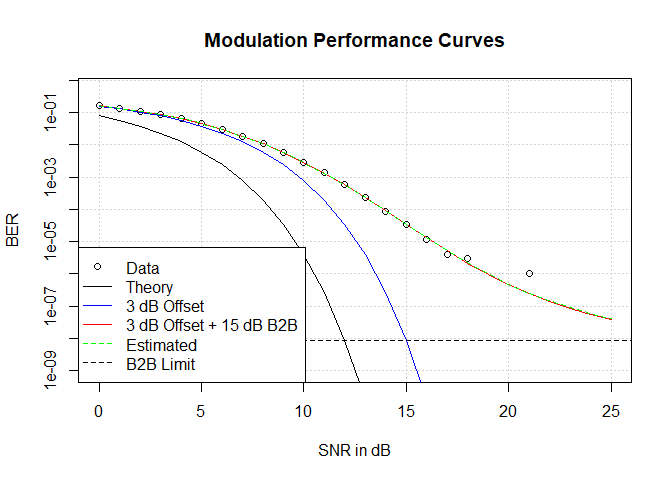

binfunest Release
================
Phil Shea
2022-09-09

# `Introduction`

<!-- badges: start -->

[](https://github.com/PhilShea/binfunest/actions/workflows/R-CMD-check.yaml)
[](https://app.codecov.io/gh/PhilShea/binfunest?branch=main)
<!-- badges: end -->

The goal of `binfunest` is to simplify the estimation of offsets and
Back-to-Back “Q” for communications systems. The package also provides
theoretical performance equations for many common modulation schemes,
and eases maximum likelihood estimation of any function generating
binomial probabilities.

## Installation

`binfunest` is available on CRAN, so `install.packages( "binfunest")`
will install it, and `library( binfunest)` will make it available. You
can install the development version of `binfunest` from
[GitHub](https://github.com/) with:

``` r
# install.packages("devtools")
devtools::install_github("PhilShea/binfunest")
```

## Example

This is a basic example which shows how to solve a common problem of
estimating the B2B Q and offset. First we create a function which will
add offset and B2B parameters to a standard communications modulation
(Quadrature Phase Shift Keying, or QPSK). The package provides
theoretical performance curves for many common modulations. Then
`rbinom` is called to simulate measurements made at a range of signal to
noise ratios (SNR). All SNRs, offsets, and B2BQs are in Decibels. Note
that the generated samples include zeros, and that the first of these
(i.e., the lowest SNR that produced zero errors) is useful in the
parameter estimate.

``` r
require( binfunest)
require( stats4)
#> Loading required package: stats4
QPSKdB.B2B <- B2BConvert( QPSKdB)
O1 <- 3 # offset
B1 <- 15 # B2BQ
s <- 0:25 # SNR Range 
N <- 1000000 # Number of samples
(r <- rbinom( length( s), N, QPSKdB.B2B( s, B1, O1)))
#>  [1] 161958 135306 109002  85035  63269  44868  29705  18587  10921   5923
#> [11]   2749   1382    593    234     88     34     12      4      3      0
#> [21]      0      1      0      0      0      0
df <- data.frame( Errors=r, SNR=s, N=N) # place data in data frame

## This shows how you could do the work by hand
llsb2 <- function( b2b, offset)
       -sum( dbinom( r, N, QPSKdB.B2B( s, b2b, offset), log=TRUE))
mle1 <- stats4::mle( llsb2, start=c( b2b=20, offset=0), nobs=length(s),
                   method="Nelder-Mead")
stats4::coef( mle1)
#>      b2b   offset 
#> 14.96665  2.99366
# Below is the new function
est1 <-  mleB2B( data=df, Errors="Errors", N=N, f=QPSKdB.B2B,
                 fparms=list( x="SNR"), start=c(b2b=20, offset=0))

(est1coef <- stats4::coef( est1))
#>      b2b   offset 
#> 14.96665  2.99366
```

The plot below compares the theoretical curve to the curve with the
chosen B2B and offset, and the curve with the estimated parameters. Note
that all samples above 18 dB SNR returned zero, except the 21 dB point.
The Estimated line is dashed so the 3 dB + Offset line, which it
overlays, is visible.

``` r
plot( s, y=r/N, log='y', type='p', panel.first = grid(), ylim=c(1e-9,0.5),
      main="Modulation Performance Curves", xlab="SNR in dB",
      ylab="BER")
#> Warning in xy.coords(x, y, xlabel, ylabel, log): 6 y values <= 0 omitted from
#> logarithmic plot
lines( s, QPSKdB( s))
lines( s, QPSKdB.B2B( s, B1, O1), col='red')
lines( s, QPSKdB.B2B( s, +Inf, O1), col='blue')
lines( s, y=QPSKdB.B2B( s, est1coef[1],  est1coef[2]), col="green", lty=2)
abline( h=QPSKdB.B2B( B1, +Inf, O1), col='black', lty=2)
legend( "bottomleft",
        legend=c( "Data",  "Theory", "3 dB Offset", "3 dB Offset + 15 dB B2B", 
                  "Estimated", "B2B Limit"),
        lty=c( NA, 1, 1, 1, 2, 2), col=c( 'black', 'black', 'blue', 'red',
                                          'green'),
        pch=c( 1, NA, NA, NA, NA, NA))
```


